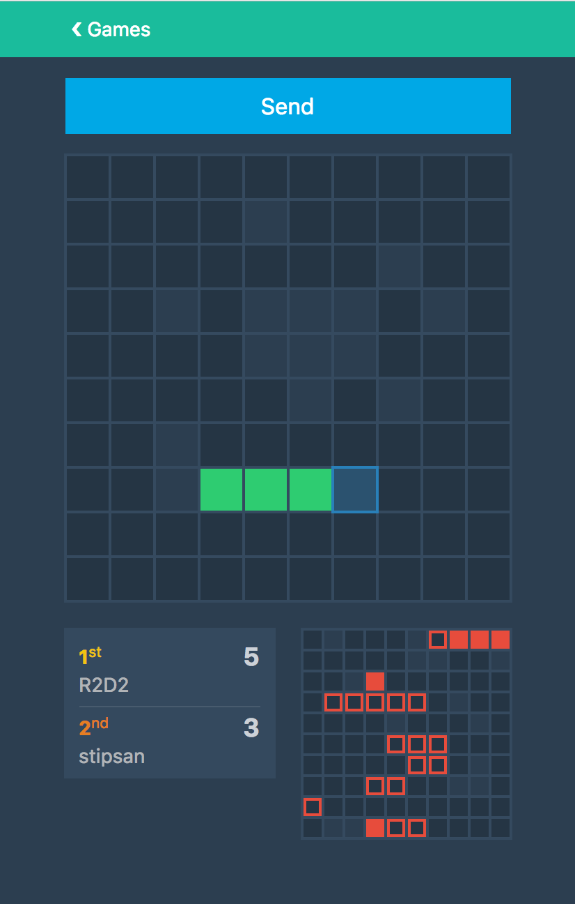

Realtime React based two-player game! Inspired by the good old "Battleship" by Hasbro and optimized for realtime gameplay.
Tech stack includes Redux, SocketCluster, Heroku, Redis and more!

It's intended to be both a learning excersise for myself to get familiar with tech I've never used before (SocketCluster, Redis) and sharpen my skills on stuff I've used a lot.

It's also meant to serve as a reference for others who wish to embark on similar projects :-)

# FAQ

## Why is (https://epic.vg) loading faster than lightning?

It's thanks to Herokus' Standard 1x dynos and CloudFlare's CDN combined with very agressive caching on all layers of the stack.
I'll share all the details later on Medium.

## How do I get started hacking away at this?

Assuming you've already got redis setup and running on your localhost, it's this easy:

1. Clone this repo
2. `npm install`
3. `npm start`

If installing a local redis isn't your cup of tea, hit the purple `Deploy` up top and [https://devcenter.heroku.com/articles/config-vars](reuse) the REDIS_URL env var the heroku-redis addon create after provision.

Be sure to install both the React and Redux Devtools for an developer experience like no other.
Complete with Hot Reload and Time Travel, making web development more fun than ever!

## Why no RelayJS?

RelayJS and GraphQL don't support realtime communication out of the box yet.
Some have managed to marry websockets and Relay [already](https://github.com/facebook/relay/issues/652#issuecomment-162299541), but I've decided to wait for it to [land](https://github.com/facebook/relay/issues/541) in the core.
This way I can move fast and not worry about bugs due to using unstable dependencies.
Once RelayJS release the new Subscriptions API I'll revisit it and probably fork this project and port it to RelayJS to see how the two stack up against each other.

## Heroku pipeline

This project is setup in a |pipeline](https://devcenter.heroku.com/articles/pipelines#deployment-with-pipelines) on Heroku.
Code pushed to **master** will be deployed if CI tests pass. When opening a PR a review app on Heroku is created so you can test the app and make sure it deploys correctly before it's pushed into production.

Each review app have their own Redis instance and is completely isolated.
The only differences between Review apps and the main app running on epic.vg is that Review Apps run on free plans on both Heroku dynos and the redis storage.
That means each is limited to one free dyno, and run the free hobbyist redis plan.
This causes two important considerations:
1. Free dynos will go to sleep after 30 mins of inactivity, and waking it from sleep can cause the initial page load to take a minute or two.
2. Free redis storage is **not** persisted, meaning data is whiped now and then as redis instances reboot.

**production** is on a paid plan. Dynos are standard 1x, redis is on the `Premium 0` plan.
Data is persisted, and performance swift.

CloudFare is setup with very aggressive caching on the production app, causing deploys to take up to 30 mins before you can see the changes.
If you can't see the new changes, check the `CF-Cache-Status` header and if it says `HIT` it's because CloudFlare haven't updated the cache with the new code yet.
CloudFlare cache does not apply to the Review apps as they run on Herokus `*.herokuapp.com` domain.

# Credits

Big thanks to [BrowserStack](https://www.browserstack.com) for providing cross browser testing to Open Source projects!
